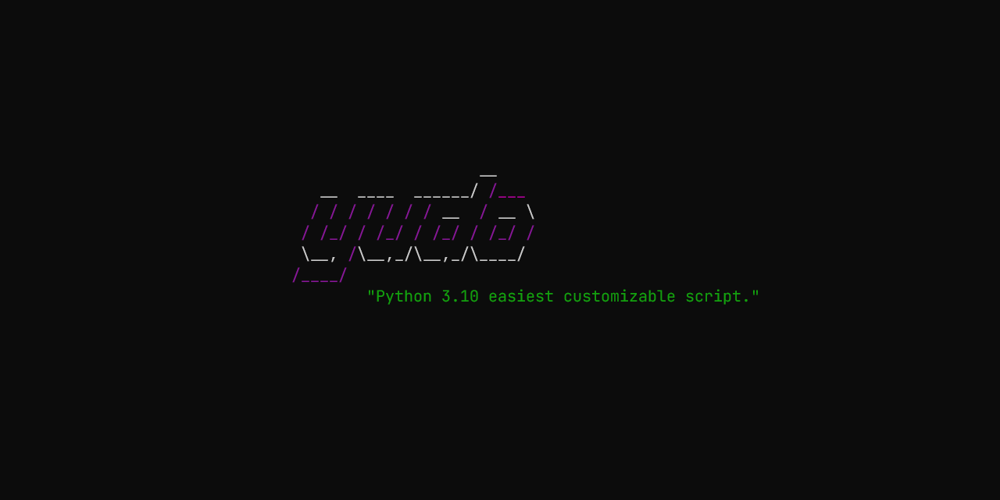

<h1 align="center">yudo</h1>

一个基于 Python 编写的易于扩展的命令行交互工具 支持多版本Python、Virtualenv、Conda等环境 支持从Cmd、Windows Terminal、PowerShell、WSL等启动

    </img>
	
	<a href="https://pypi.org/project/click/"></img></a>

[字体：JetBrains Mono]: https://www.jetbrains.com/lp/mono/

